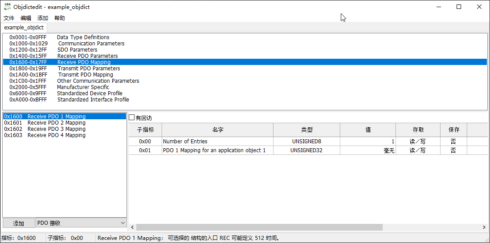

# 1. 安装 Python

- 版本 2.7
- 目前 objdictgen 仅支持 Python2
- 将 C:\Python27 和 C:\Python27\Scripts 加入 Path 环境变量

# 2. 安装 wxPython

- 地址 [wxPython2.8.12.1](https://sourceforge.net/projects/wxpython/files/wxPython/2.8.12.1/)

# 3. 安装 Gnosis

- 将 objdictgen 目录下的 Gnosis_Utils-current.tar.gz 解压
- 运行 `python setup.py install`

# 4. 运行

- `python objdictedit.py`运行效果如下

